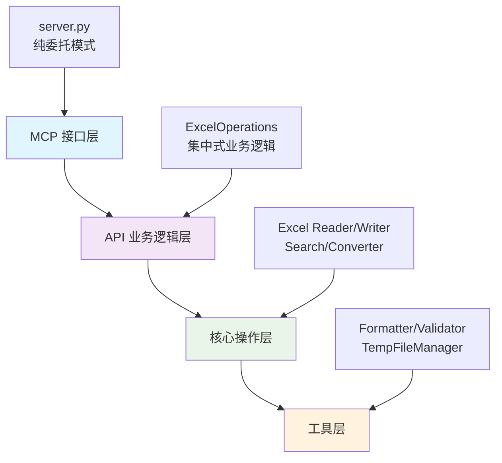

<div align="center">

[中文](README.md) ｜ [English](README.en.md)

</div>

# 🎮 ExcelMCP: 游戏开发专用 Excel 配置表管理器

[](https://opensource.org/licenses/MIT)
[](https://www.python.org/downloads/)
[](https://github.com/jlowin/fastmcp)


**ExcelMCP** 是**支持游戏开发配置表管理**的 MCP (Model Context Protocol) 服务器。通过 AI 自然语言指令，实现技能配置表、装备数据、怪物属性等游戏配置的智能化操作。基于 **FastMCP** 和 **openpyxl** 构建，拥有 **35个专业工具** 和 **699个测试用例**，**78.58%代码覆盖率**，提供可靠的Excel文件操作能力。

🎯 **支持游戏开发场景：** 技能系统、装备管理、怪物配置、游戏数值平衡、版本对比、策划工具链。

---

## 📋 目录导航

- [🎮 游戏配置表专业管理](#-游戏配置表专业管理)
- [🚀 快速入门](#-快速入门-3-分钟设置)
- [⚡ 快速参考](#-快速参考)
- [📖 详细使用指南](#-详细使用指南)
- [🛠️ 完整工具列表](#️-完整工具列表35个工具)
- [🏗️ 技术架构](#️-技术架构)
- [📊 测试情况](#-测试情况)
- [❓ 常见问题](#-常见问题)
- [🤝 贡献指南](#-贡献指南)

### 🔗 快速跳转
- [👨‍💻 开发者指南](#-开发者指南) - 扩展开发和测试
- [🎮 游戏配置表标准](#-游戏配置表标准格式) - 游戏开发专用格式
- [🔧 API接口规范](#-api接口规范) - 技术实现细节

## 🎮 游戏配置表专业管理

### 🎯 游戏开发核心功能

- **🛡️ [技能配置表](#-游戏配置表标准格式)** (TrSkill): 技能ID、名称、类型、等级、消耗、冷却、伤害、描述
- **⚔️ [装备配置表](#-游戏配置表标准格式)** (TrItem): 装备ID、名称、类型、品质、属性、套装、获取方式
- **👹 [怪物配置表](#-游戏配置表标准格式)** (TrMonster): 怪物ID、名称、等级、血量、攻击、防御、技能、掉落
- **🎁 道具配置表** (TrProps): 道具ID、名称、类型、数量、效果、获取、描述

### ✨ 35个专业工具分类

- **📁 [文件和工作表管理](#-文件与工作表管理)** (8工具): 创建、转换、合并、导入导出、文件信息
- **📊 [数据操作](#-数据操作)** (8工具): 范围读写、行列管理、数据更新、公式保护
- **🔍 [搜索和分析](#-搜索与分析)** (4工具): 正则搜索、目录搜索、游戏表头分析、重复ID检测
- **🎨 [格式化和样式](#-格式化与样式)** (6工具): 预设样式、边框设置、合并单元格、行列尺寸
- **🔄 [数据转换](#-数据转换)** (4工具): CSV导入导出、格式转换、文件合并

### 🔒 项目可靠性

- **699个测试用例** 持续集成测试，确保功能稳定性
- **分层架构设计** MCP接口层 → API业务逻辑层 → 核心操作层 → 工具层
- **统一错误处理** 集中化异常管理和用户友好提示
- **基础性能优化** 工作簿缓存、内存管理、文件处理
- **游戏配置支持** 双行表头系统、ID对象跟踪、版本对比

---

## 📖 详细使用指南

### 🎯 渐进式学习路径

#### ⭐ 新手入门 (5分钟)
**目标**: 快速上手基础Excel操作

```text
⭐ 基础操作: "读取 sales.xlsx 中 A1:C10 的数据"
⭐ 文件信息: "获取 report.xlsx 的基本信息和工作表列表"
⭐ 简单搜索: "在 data.xlsx 中查找包含'总计'的单元格"
```

#### ⭐⭐ 进阶应用 (15分钟)
**目标**: 掌握数据操作和格式化

```text
⭐⭐ 数据更新: "将 skills.xlsx 第2列的所有数值乘以1.2"
⭐⭐ 格式设置: "把 report.xlsx 的第一行设置为粗体，背景浅蓝色"
⭐⭐ 范围操作: "在 inventory.xlsx 中插入3行到第5行位置"
```

#### ⭐⭐⭐ 专家级应用 (30分钟)
**目标**: 游戏配置表专业管理

```text
⭐⭐⭐ 配置对比: "比较v1.0和v1.1版本的技能配置表，生成详细变更报告"
⭐⭐⭐ 批量分析: "分析所有怪物配置表，确保等级20-30的血量攻击比合理"
⭐⭐⭐ 复杂操作: "将装备表中所有传说品质物品的属性值提升25%，并用金色标记"
```

### 💡 游戏开发场景示例

**技能配置表管理：** ⭐⭐⭐

```bash
"在技能配置表中查找所有火系技能，将伤害值统一提升20%，并用红色高亮显示"
```

**装备数据分析：** ⭐⭐⭐

```bash
"比较新旧版本的装备配置表，找出所有属性变更的装备，生成详细的变更报告"
```

**游戏数值平衡：** ⭐⭐

```bash
"检查怪物配置表中所有等级20-30的怪物，确保血量和攻击力的比例在合理范围内"
```

**示例提示:** ⭐⭐

```text
"在 `quarterly_sales.xlsx` 中，查找'地区'为'北部'且'销售额'超过 5000 的所有行。将它们复制到一个名为'Top Performers'的新工作表中，并将标题格式设置为蓝色。"
```

### 🎮 游戏配置表标准格式

**双行表头系统 (游戏开发专用):** ⭐⭐
```
第1行(描述): ['技能ID描述', '技能名称描述', '技能类型描述', '技能等级描述']
第2行(字段): ['skill_id', 'skill_name', 'skill_type', 'skill_level']
```

### 📚 推荐学习顺序

1. **环境设置** → 2. **基础操作** → 3. **数据格式化** → 4. **搜索分析** → 5. **游戏配置管理** → 6. **高级自动化**

---

## 🏗️ 技术架构

### 分层架构设计



### 核心组件详解

#### 🔹 MCP接口层 (server.py)
```python
# 纯委托模式示例
@mcp.tool()
def excel_get_range(file_path: str, range: str):
    return self.excel_ops.get_range(file_path, range)

# 核心职责:
- 参数接收和转发
- 结果格式化输出
- MCP协议适配
- 零业务逻辑实现
```

#### 🔹 API业务逻辑层 (excel_operations.py)
```python
class ExcelOperations:
    # 统一业务逻辑处理
    def get_range(self, file_path: str, range: str):
        # 1. 参数验证
        # 2. 业务逻辑执行
        # 3. 错误处理
        # 4. 结果格式化
        return OperationResult(success, data, message, metadata)
```

#### 🔹 核心操作层 (core/*)
- **ExcelReader**: 文件读取和工作簿缓存
- **ExcelWriter**: 安全写入和公式保护
- **ExcelSearch**: 正则搜索和批量操作
- **ExcelConverter**: 格式转换和数据迁移

#### 🔹 工具层 (utils/*)
- **Formatter**: 样式格式化和预设管理
- **Validator**: 参数验证和类型检查
- **TempFileManager**: 临时文件生命周期管理
- **ExceptionHandler**: 异常捕获和用户友好提示

### 设计原则

- **🔹 纯委托模式**: MCP接口层仅负责接口定义，零业务逻辑
- **🔹 集中式处理**: 统一的参数验证、错误处理、结果格式化
- **🔹 1-Based索引**: 匹配Excel约定（第1行=第一行，A列=1）
- **🔹 现实并发**: 正确处理Excel文件并发限制，提供序列化解决方案

### 🔧 API接口规范

#### 标准化结果格式
```python
OperationResult = {
    "success": bool,        # 操作是否成功
    "data": Any,           # 返回的数据内容
    "message": str,        # 用户友好的状态信息
    "metadata": {          # 元数据信息
        "operation": str,    # 操作类型
        "duration": float,   # 执行时间(ms)
        "affected_cells": int, # 影响的单元格数
        "warnings": list     # 警告信息列表
    }
}
```

#### 参数验证机制
```python
# 统一验证流程
def validate_range_expression(range_expr: str) -> bool:
    # 1. 格式验证 (SheetName!A1:C10)
    # 2. 工作表存在性检查
    # 3. 范围边界验证
    # 4. 权限检查

def validate_file_path(file_path: str) -> bool:
    # 1. 路径安全性检查
    # 2. 文件格式验证
    # 3. 访问权限确认
    # 4. 并发状态检查
```

---

## 🚀 快速入门 (3 分钟设置)

在您喜欢的 MCP 客户端（VS Code 配 Continue、Cursor、Claude Desktop 或任何 MCP 兼容客户端）中运行 ExcelMCP。

### 先决条件

- Python 3.10+
- 一个与 MCP 兼容的客户端

### 安装

1. **克隆存储库:**

    ```bash
    git clone https://github.com/tangjian/excel-mcp-server.git
    cd excel-mcp-server
    ```

2. **安装依赖项:**

    使用 **uv**（推荐，速度更快）:

    ```bash
    pip install uv
    uv sync
    ```

    或使用 **pip**:

    ```bash
    pip install -e .
    ```

3. **配置您的 MCP 客户端:**

    添加到您的 MCP 客户端配置中（`.vscode/mcp.json`、`.cursor/mcp.json` 等）:

    ```json
    {
      "mcpServers": {
        "excelmcp": {
          "command": "python",
          "args": ["-m", "src.server"],
          "env": {
            "PYTHONPATH": "${workspaceRoot}"
          }
        }
      }
    }
    ```

4. **开始自动化！**

    准备就绪！让您的 AI 助手通过自然语言控制 Excel 文件。

---

## ⚡ 快速参考

### 🎯 常用命令速查表

#### ⭐ 基础操作 (新手级)
```text
读取数据:      "读取 sales.xlsx 的 A1:C10 范围数据"
文件信息:      "获取 report.xlsx 的基本信息"
工作表列表:    "列出 data.xlsx 中所有工作表"
简单搜索:      "在 skills.xlsx 中查找'火球术'"
```

#### ⭐⭐ 数据操作 (进阶级)
```text
更新数据:      "将 skills.xlsx 第2列所有数值乘以1.2"
插入行:        "在 inventory.xlsx 第5行插入3个空行"
格式设置:      "把 report.xlsx 第一行设为粗体，背景浅蓝"
删除数据:      "删除 data.xlsx 的 3-5 行"
```

#### ⭐⭐⭐ 游戏开发专用 (专家级)
```text
配置对比:      "比较v1.0和v1.1版本技能表，生成变更报告"
批量分析:      "分析所有20-30级怪物的血量攻击比"
属性调整:      "将装备表中传说品质物品属性提升25%"
ID检测:        "检查技能表中是否有重复的技能ID"
```

### 🎮 游戏开发场景速查

| 场景 | 推荐工具 | 复杂度 | 示例命令 |
|------|----------|---------|----------|
| 技能平衡调整 | `excel_search` + `excel_update_range` | ⭐⭐⭐ | "将所有火系技能伤害提升20%" |
| 装备配置管理 | `excel_get_range` + `excel_format_cells` | ⭐⭐ | "用金色标记所有传说装备" |
| 怪物数据验证 | `excel_search` + `excel_check_duplicate_ids` | ⭐⭐⭐ | "确保怪物ID唯一，血量合理" |
| 版本对比分析 | `excel_compare_sheets` + `excel_search` | ⭐⭐⭐ | "对比新旧版本配置表差异" |
| 批量格式化 | `excel_format_cells` + `excel_merge_cells` | ⭐⭐ | "统一所有表头格式和样式" |

### 🔧 范围表达式参考

| 格式 | 说明 | 示例 |
|------|------|------|
| `Sheet1!A1:C10` | 标准范围 | "技能表!A1:D50" |
| `Sheet1!1:5` | 行范围 | "配置表!2:100" |
| `Sheet1!B:D` | 列范围 | "数据表!B:G" |
| `Sheet1!A1` | 单单元格 | "设置表!A1" |
| `Sheet1!5` | 单行 | "表头!5" |
| `Sheet1!C` | 单列 | "ID列!C" |

### 💡 效率技巧

- **批量操作优先**: 一次操作整个范围而非逐个单元格
- **搜索先行**: 使用 `excel_search` 定位数据再进行操作
- **格式模板**: 建立标准格式模板，保持一致性
- **版本管理**: 重要修改前使用 `excel_copy_range` 备份
- **错误预防**: 大规模修改前先用小范围测试

---

## 🛠️ 完整工具列表（35个工具）

### 📁 文件与工作表管理

| 工具 | 用途 |
|------|------|
| `excel_create_file` | 创建新的 Excel 文件（.xlsx/.xlsm），支持自定义工作表 |
| `excel_create_sheet` | 在现有文件中添加新工作表 |
| `excel_delete_sheet` | 删除指定工作表 |
| `excel_list_sheets` | 列出工作表名称和获取文件信息 |
| `excel_rename_sheet` | 重命名工作表 |
| `excel_get_file_info` | 获取文件元数据（大小、创建日期等） |
| `excel_get_sheet_headers` | 获取所有工作表的表头信息 |
| `excel_merge_files` | 合并多个 Excel 文件 |

### 📊 数据操作

| 工具 | 用途 |
|------|------|
| `excel_get_range` | 读取单元格/行/列范围（支持 A1:C10、行范围、列范围等） |
| `excel_update_range` | 写入/更新数据范围，支持公式保留 |
| `excel_get_headers` | 从任意行提取表头 |
| `excel_get_sheet_headers` | 获取所有工作表的表头 |
| `excel_insert_rows` | 插入空行到指定位置 |
| `excel_delete_rows` | 删除行范围 |
| `excel_insert_columns` | 插入空列到指定位置 |
| `excel_delete_columns` | 删除列范围 |
| `excel_find_last_row` | 查找表格中最后一行有数据的位置 |

### 🔍 搜索与分析

| 工具 | 用途 |
|------|------|
| `excel_search` | 在工作表中进行正则表达式搜索 |
| `excel_search_directory` | 在目录中的所有 Excel 文件中批量搜索 |
| `excel_compare_sheets` | 比较两个工作表，检测变化（针对游戏配置优化） |
| `excel_check_duplicate_ids` | 检查Excel工作表中ID列的重复值 |

### 🎨 格式化与样式

| 工具 | 用途 |
|------|------|
| `excel_format_cells` | 应用字体、颜色、对齐等格式（预设或自定义） |
| `excel_set_borders` | 设置单元格边框样式 |
| `excel_merge_cells` | 合并单元格范围 |
| `excel_unmerge_cells` | 取消合并单元格 |
| `excel_set_column_width` | 调整列宽 |
| `excel_set_row_height` | 调整行高 |

### 🔄 数据转换

| 工具 | 用途 |
|------|------|
| `excel_export_to_csv` | 导出工作表为 CSV 格式 |
| `excel_import_from_csv` | 从 CSV 创建 Excel 文件 |
| `excel_convert_format` | 在 Excel 格式间转换（.xlsx、.xlsm、.csv、.json） |

### 💡 用例

- **数据清理**: "在 `/reports` 目录中的所有 `.xlsx` 文件中，查找包含 `N/A` 的单元格，并将其替换为空值。"
- **自动报告**: "创建一个新文件 `summary.xlsx`。将 `sales_data.xlsx` 中的范围 `A1:F20` 复制到名为'Sales'的工作表中，并将 `inventory.xlsx` 中的 `A1:D15` 复制到名为'Inventory'的工作表中。"
- **数据提取**: "获取 `contacts.xlsx` 中 A 列为'Active'的所有 D 列的值。"
- **批量格式化**: "在 `financials.xlsx` 中，将整个第一行加粗，并将其背景颜色设置为浅灰色。"

---

## 📊 测试情况

- **📈 总测试用例**: 699个
- **🎯 测试结果**: 696 passed, 2 failed, 1 skipped
- **📊 代码覆盖率**: 78.58%
- **📁 文件支持**: .xlsx, .xlsm, .csv
- **🔍 搜索能力**: 正则表达式、批量搜索、跨文件搜索

### 性能特点

- 基于openpyxl的稳定Excel文件操作
- 支持大文件处理，具体性能取决于文件大小和系统配置
- 提供基础缓存机制优化重复操作
- 建议在使用前根据具体需求进行性能测试

---

## ❓ 常见问题

### 🔧 安装和配置

**Q: 支持哪些Python版本？**
A: 支持 Python 3.10+ 版本，推荐使用 Python 3.11 或更高版本以获得最佳性能。

**Q: 如何配置MCP客户端？**
A: 在客户端配置文件中添加：
```json
{
  "mcpServers": {
    "excelmcp": {
      "command": "python",
      "args": ["-m", "src.server"],
      "env": {"PYTHONPATH": "${workspaceRoot}"}
    }
  }
}
```

**Q: 支持哪些Excel格式？**
A: 支持 `.xlsx`、`.xlsm` 格式，以及通过导入导出功能支持 `.csv` 格式。

### 💻 使用问题

**Q: 如何处理中文工作表名？**
A: 完全支持中文工作表名和内容，使用示例：
```text
"在技能配置表中查找所有火系技能"
```

**Q: 大文件处理性能如何？**
A: 基于openpyxl的性能，具体取决于文件大小和系统配置。建议对大文件进行分批处理。

**Q: 如何确保数据安全？**
A:
- 所有操作都有完整的错误处理
- 支持操作预览和确认
- 不会意外修改公式（默认保留）

### 🚨 错误处理

**Q: 文件被锁定怎么办？**
A: 关闭Excel程序后重试，系统会自动检测并处理文件锁定问题。

**Q: 出现编码问题怎么解决？**
A: 系统自动处理UTF-8和GBK编码，如遇问题可指定编码格式。

**Q: 内存不足如何处理？**
A: 系统自动分批处理大文件，避免内存溢出。

### 🎮 游戏开发专用

**Q: 什么是双行表头系统？**
A: 游戏配置表标准格式：
- 第1行：字段描述（如"技能ID描述"）
- 第2行：字段名（如"skill_id"）

**Q: 如何进行版本对比？**
A: 使用专门的配置表对比工具：
```text
"比较v1.0和v1.1版本的技能配置表，生成变更报告"
```

---

## 👨‍💻 开发者指南

### 🔧 扩展开发
```python
# 添加新的Excel操作工具
@mcp.tool()
def excel_custom_operation(file_path: str, sheet_name: str, custom_params: dict):
    """
    自定义Excel操作示例
    """
    return self.excel_ops.custom_operation(file_path, sheet_name, custom_params)
```

### 🧪 测试开发
```bash
# 运行特定模块测试
python -m pytest tests/test_core.py -v

# 运行API接口测试
python -m pytest tests/test_api_excel_operations.py -v

# 生成覆盖率报告
python -m pytest tests/ --cov=src --cov-report=html
```

### 📝 代码规范
- **纯委托模式**: `server.py` 中的MCP工具严格委托给 `ExcelOperations`
- **集中式业务逻辑**: 所有业务逻辑集中在 `excel_operations.py`
- **统一错误处理**: 使用 `OperationResult` 格式返回结果
- **1-Based索引**: 遵循Excel的索引约定

### 🚀 性能优化建议
- **批量操作**: 优先使用范围操作而非单单元格操作
- **工作簿缓存**: 合理利用缓存机制避免重复加载
- **内存管理**: 大文件分批处理，避免内存溢出
- **并发控制**: 正确处理Excel文件锁定问题

---

## 🤝 贡献指南

### 参与贡献

我们欢迎所有形式的贡献！请查看我们的 `CONTRIBUTING.md` 了解详细信息。

**开发规范:**
- 所有功能分支必须以 `feature/` 开头
- 遵循现有的代码架构和测试规范
- 确保测试覆盖率稳定在78%以上

**贡献方式:**
- 🐛 报告Bug
- 💡 提出新功能建议
- 📝 改进文档
- 🔧 提交代码修复

### 📜 许可证

该项目根据 MIT 许可证授权。有关详细信息，请参阅 [LICENSE](LICENSE) 文件。

---

### 🔝 回到顶部
[📋 返回目录导航](#-目录导航) | [🚀 快速开始使用](#-快速入门-3-分钟设置) | [⚡ 查看快速参考](#-快速参考)